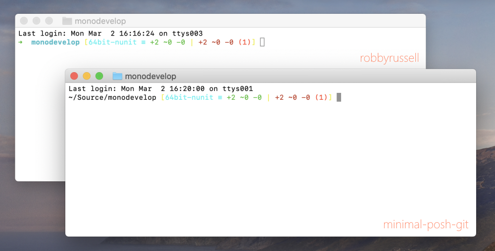

# zsh

- Install [Oh My Zsh](https://github.com/ohmyzsh/ohmyzsh)
- Copy the file `git_prompt_info.sh` to `~/.oh-my-zsh/custom/`
- Restart Terminal

## Optional
Oh My Zsh uses themes which might or might not use the custom git info prompt defined in `git_prompt_info.sh`.
If you like the zsh default theme named "robbyrussell" but prefer the whole directory path instead of the current folder, you can use my custom theme `minimal-posh-git.zsh-theme`.

 

### How to install

- Copy the theme file from the `themes` folder to `~/.oh-my-zsh/custom/themes/`
- Edit the file `~/.zshrc` and set `ZSH_THEME="minimal-posh-git"` 
- Restart Terminal     

## Notes
The main part of the file `git_prompt_info.sh` is taken from [lyze/posh-git-sh](https://github.com/lyze/posh-git-sh/blob/master/git-prompt.sh). You can easily update the git prompt file by copying a newer version from GitHub to `git_prompt_info.sh`. Just make sure to keep the upper 20 lines of code.

Make sure that you don't have a colliding .git_prompt.sh file in your use folder. 
